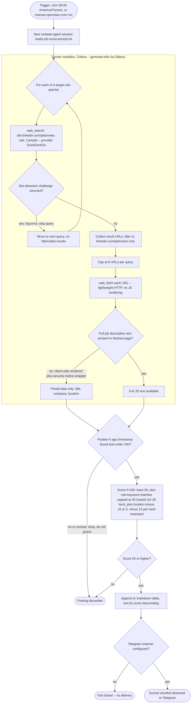

# LinkedIn Job Scout Agent

A local, self-hosted AI agent that scouts LinkedIn job postings for target roles in Canada and produces a scored shortlist — built on [OpenClaw](https://github.com/) running a local model via [Ollama](https://ollama.com), with no cloud LLM calls and no direct scraping of LinkedIn.

## Problem

Manually re-searching LinkedIn every day for a handful of target roles (Solutions Engineer, Business Analyst, Product Analyst, Technical Account Manager) across a set of target Canadian cities is repetitive and easy to fall behind on. I wanted an agent that could run the searches, filter for recency, and rank postings against a consistent rubric — without logging into LinkedIn or scraping it directly, which would violate its Terms of Service.

## Solution / Architecture

- **Agent runtime:** [OpenClaw](https://github.com/) — a local agent framework that runs against a locally-hosted model via Ollama (`gemma4:e4b`, 4B params) instead of a cloud LLM.
- **Trigger:** a cron job at 08:00 America/Toronto (via `openclaw cron`), or a manual run, starts a fresh, isolated agent session that loads `job-scout-prompt.txt`.
- **Discovery, not scraping:** the agent never authenticates to or crawls LinkedIn. It uses OpenClaw's `web_search` tool with `site:linkedin.com/jobs/view` search-engine queries (via DuckDuckGo) to discover public job posting URLs, and `web_fetch` (a lightweight, non-JS HTTP fetch) to pull whatever page text is available for recency checks.
- **Sandboxing:** the model and its tools run inside a Docker sandbox (via Colima on macOS), so a small local model with tool access isn't running against the host directly.
- **Prompt-driven pipeline:** the entire search → filter → score → report flow is defined in a single agent prompt (see [`job-scout-prompt.txt`](./job-scout-prompt.txt)), not custom application code. Four target-role search queries, an 8-URL-per-query cap, a deterministic 0–100 scoring rubric (base score + keyword matches + location bonus − hard-mismatch penalties), and a markdown output table sorted by score, threshold 55+.
- **Fail-closed delivery:** the scored shortlist is delivered to a configured Telegram channel; if no Telegram channel is configured, the run fails closed rather than silently dropping the output somewhere else.

### Flow



## Challenges

Building this surfaced a real chain of infrastructure issues, in the order I hit them:

1. **`web_search` wasn't configured out of the box.** OpenClaw didn't ship with a working search provider. Set up [DuckDuckGo](https://duckduckgo.com) as the provider since it's key-free — no API signup needed to get search working.

2. **Security audit flagged the sandbox gap.** Running an open-web-tools-capable small local model (`gemma4:e4b`, 4B params) with unrestricted host access was flagged as a risk during review. Fixed by enabling Docker-based sandboxing, using [Colima](https://github.com/abiosoft/colima) as the container runtime on macOS.

3. **The sandbox needed a custom image.** The OpenClaw npm install didn't ship a ready-made sandbox image, so I built a custom one — `openclaw-sandbox:bookworm-slim` — from a Dockerfile, to give the sandboxed process a minimal but functional environment.

4. **"Tool Search" indirection broke tool discovery for the small model.** OpenClaw supports a `tool_search`/`tool_call` indirection mode where the model discovers tools dynamically instead of seeing them all up front. The 4B local model couldn't reliably use this indirection to find `web_search` — it would either not call it or hallucinate around it. Fixed by disabling Tool Search and exposing tools directly in the model's context instead.

5. **Two separate, non-inheriting tool allowlists.** OpenClaw has both a general `tools.allow` policy and a sandbox-specific `tools.sandbox.tools.allow` policy, and they do **not** inherit from each other. I had to add `group:web` to both explicitly. I also learned the hard way that setting `tools.allow` **replaces** the default profile with an explicit list rather than adding to it — so an incomplete list silently drops other tools you assumed you still had.

6. **Verified `web_search` end-to-end.** After the above fixes, `web_search` returned real LinkedIn job URLs (see Results below for a trimmed example).

7. **Discovered a real ceiling: `web_fetch` can't read LinkedIn job descriptions.** `web_fetch` is a lightweight HTTP fetch with no JS rendering. LinkedIn job description bodies are client-side rendered, so `web_fetch` only reliably returns page shell/metadata, not the actual JD text. This constrains scoring to signals available without full-page rendering (title, company, location, and whatever text is present in the fetched shell) rather than true full-JD keyword matching against the rubric's role-keyword lists.

8. **DuckDuckGo's free search endpoint has bot-detection that triggers mid-session.** Running the four target-role queries back to back was enough to trip DuckDuckGo's bot-detection after the first query succeeded — server logs showed `"DuckDuckGo returned a bot-detection challenge"` on the subsequent calls. This is a known constraint of a free/scraped search tier, not something request pacing alone fully resolves (the prompt now includes an explicit "wait a few seconds between calls" instruction, which helps but doesn't eliminate it). I also tried switching to Firecrawl's free tier (`firecrawl-free`) as an alternate provider, but hit a separate, unresolved configuration bug (`WEB_SEARCH_PROVIDER_INVALID_AUTODETECT`) despite following its documented setup — reverted to DuckDuckGo rather than keep debugging an apparent framework issue.

## Results

**What worked:** the search and link-discovery stage is solid when it isn't rate-limited. `web_search` via DuckDuckGo reliably surfaces real, current LinkedIn job posting URLs for `site:linkedin.com/jobs/view` queries. Example, from a live run of the query `site:linkedin.com/jobs/view "Solutions Engineer" Canada`, which returned 5 real LinkedIn job URLs in under 1 second:

```
1. https://ca.linkedin.com/jobs/view/solutions-engineer-at-peregrine-4448060294
   Peregrine hiring Solutions Engineer in Canada
2. https://ca.linkedin.com/jobs/view/microsoft-365-ai-solutions-engineer-at-resonaite-4460645075
   Microsoft 365 & AI Solutions Engineer at Resonaite
3. https://www.linkedin.com/jobs/view/4454821161/
   1Password hiring Solutions Engineer, SMB in Canada
4. https://www.linkedin.com/jobs/view/4460045566/
   CompuMed Solutions hiring Data Engineer in Breslau, Ontario, Canada
5. https://ca.linkedin.com/jobs/view/solutions-engineer-central-western-canada-at-ecam-4451603215
   ECAM hiring Solutions Engineer, Central & Western Canada
```

One of those (the Peregrine posting) was then fetched and scored end-to-end: **60/100** — base 50 + location bonus +10 (Canada), with role-keyword matching left at 0 rather than guessed, because the fetched page text was blocked by LinkedIn's own client-side rendering and security notices before reaching the actual job description body. The agent explicitly declined to fabricate the keyword-match component it couldn't verify, and said so in its delivered output rather than silently assuming a score.

**What didn't work (fully):**
- The recency-verification and full scoring steps (Steps 2–3 of the prompt) are limited by `web_fetch`'s lack of JS rendering. LinkedIn's "Posted X hours ago" timestamp and full job description text are both delivered client-side, so `web_fetch` can't reliably extract them. In practice this means the pipeline can discover and title/company/location-filter postings, but can't yet do the full keyword-against-description scoring the rubric calls for, or confidently confirm 24-hour recency — the prompt is explicitly written to drop (not guess at) postings where that data isn't available, per the "don't fabricate" instruction in Steps 2–4.
- Running all four target-role queries in one session reliably hit DuckDuckGo's bot-detection after the first query or two, so multi-role runs in practice only reliably complete one role query per session without hitting a rate limit (see Challenge #8).

### Evidence

Screenshots from live OpenClaw sessions running this pipeline:


*Scoring walkthrough: base score, location bonus, and the model explicitly stating it can't calculate the role-keyword component because the description was blocked by LinkedIn's security notices.*


*A `web_search` call for `site:linkedin.com/jobs/view Solutions Engineer Canada` returning real LinkedIn job URLs.*


*The agent listing its available tools and flagging that `web_search` wasn't yet reachable, before the Tool Search / allowlist fixes described in Challenges #4–5.*

## Limitations / Future Work

- **JS-rendered content is the core blocker.** To get real JD-text scoring and recency data, `web_fetch` would need to be replaced or supplemented with a headless-browser fetch tool (e.g. Playwright) capable of executing LinkedIn's client-side rendering — or the agent would need an alternate, ToS-compliant data source for full posting text.
- **Search coverage depends on indexing.** DuckDuckGo's index of `linkedin.com/jobs/view` pages may lag or miss postings that Google indexes faster (or vice versa); results aren't guaranteed to be exhaustive.
- **No persistence/dedup yet.** Each run is independent — there's no store of previously-seen postings, so nothing currently prevents re-surfacing the same job across runs.
- **Small local model reliability.** Running on a 4B-parameter model keeps this fully local and private, but the model's tool-use reliability is noticeably weaker than a larger hosted model (see the Tool Search issue above); some prompt steps may need tightening as edge cases surface.
- **Sandboxing overhead.** The Docker/Colima sandbox layer adds startup latency versus running the model tools directly on the host — an acceptable tradeoff for safety, but worth noting for anyone trying to run this as a fast scheduled job.
